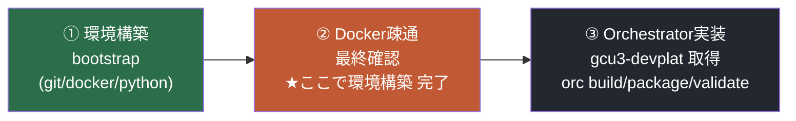

# GCU3 環境構築 完了確認 と 次段階（Orchestrator実装）への引き継ぎ v1.0

> **位置づけ**：bootstrap による環境構築フェーズの「完了判定」と、その先に必要な
> **Orchestrator本体の実装**（`orc`）の**場所・前提・手順**を明示する引き継ぎ資料。
> **作成**：2026-07-27 / Osaka
> **前提**：WSL2 Ubuntu 24.04（ユーザー例: gcu3pf）で bootstrap 実行済み

> **現在の推奨構成**：編集と軽量チェックは WSL2、Yocto は明示的な
> `gcu3-platform-azure` Docker context 経由で既存 Azure VM 上に分離します。
> ローカル Docker の `default` context は変更しません。手順は
> [`docs/AZURE_REMOTE_YOCTO.md`](docs/AZURE_REMOTE_YOCTO.md) を参照してください。

---

## 0. 全体のどこにいるか



- **①②が本ツール(bootstrap)の範囲** → ② の疎通確認で **環境構築は完了**。
- **③ は別リポジトリ（gcu3-devplat）** の作業 → **本ツールには含まれない**。

---

## 1. 【完了判定】Docker 疎通の最終確認

以下を 🐧 Ubuntu(bash) で **1行ずつ** 実行し、すべて期待どおりなら**環境構築フェーズ完了**とします。

### 1-1. グループ反映

```
newgrp docker
```

### 1-2. デーモン疎通（sudoなしで通ること）

```
docker --context default ps
```

期待：エラーなく空 or 一覧が表示される（`permission denied` が出ない）。

### 1-3. hello-world 疎通

```
docker --context default run --rm hello-world
```

期待：`Hello from Docker!` が表示される。

### 1-4. Compose / Buildx

```
docker --context default compose version
```

```
docker buildx version
```

期待：いずれもバージョンが表示される。

### 1-5. 付随ツール（1行ずつ）

```
python3 --version
```

```
git --version
```

```
tree --version
```

期待：`Python 3.12.x` / `git 2.x` / `tree v2.x`。

---

## 2. 完了チェックリスト（Definition of Done）

すべて ✅ なら **環境構築フェーズ 完了** です。

| # | 確認項目 | 期待 | 状態 |
|---|---|---|---|
| 1 | `docker ps`（sudoなし） | エラーなし | ☐ |
| 2 | `docker run --rm hello-world` | Hello from Docker! | ☐ |
| 3 | `docker compose version` | 表示される | ☐ |
| 4 | `python3 --version` | 3.12.x | ☐ |
| 5 | `git --version` | 2.x | ☐ |
| 6 | `tree --version` | v2.x | ☐ |
| 7 | systemd 稼働 | `ps -p 1 -o comm=` が systemd | ☐ |
| 8 | 自動更新 timer | `systemctl is-enabled gcu3-update.timer` が enabled | ☐ |

> `permission denied ... docker.sock` は **未完了ではなくグループ未反映**。`newgrp docker` か再ログインで解消（README §8）。

---

## 3. 【重要】ここから先は別作業：Orchestrator 本体の実装

### 3-1. なぜ別なのか（スコープの明示）

| 区分 | 内容 | リポジトリ | 本ツール |
|---|---|---|---|
| 環境構築 | WSL2 / Docker / Python / git 等 | **gcu3-bootstrap** | ✅ 含む |
| **Orchestrator本体** | `orc`（build/package/validate/tvp）実装 | **gcu3-devplat** | ❌ 含まない |

- `orc` は **設計文書（構想/要件/基本/詳細/実装ガイド）に基づき、これから実装するアプリ**です。
- 現在の `gcu3-bootstrap` には `orc` は入っていません（`orc: command not found` は正常）。

### 3-2. 実装物の「場所」

```text
~/workspace/
├─ gcu3-bootstrap/         ← 本ツール（環境構築）※完了
└─ gcu3-devplat/           ← ★Orchestrator本体（これから）
   ├─ pyproject.toml       (orc エントリ: orchestrator.cli:main)
   ├─ src/orchestrator/    (config/proxy/secret/adapters/packaging/validation/tvp/…)
   ├─ schemas/             (manifest/tvp-request/build-map/asset-inventory)
   ├─ profiles/            (office-osaka/home-squid/azure-vm)
   ├─ build-map/ inventory/ tests/ docs/
```

> 実装の設計根拠は「Copilot作成」フォルダの以下を参照：
> `01_構想設計` / `03_要件定義` / `04_基本設計` / `05_詳細設計` / `06_実装ガイドライン`
> および雛形 `gcu3-devplat_skeleton_v1.00.zip`。

### 3-3. 実装着手の「手順」

#### STEP A：本体リポジトリを取得（🐧 Ubuntu）

GitHub版（推奨）:

```
cd ~/workspace
```

```
git clone git@github.com:<ORG>/gcu3-devplat.git
```

または雛形ZIP（skeleton）を展開:

```
cd ~/workspace
```

```
unzip /mnt/c/Users/<WindowsUser>/Downloads/gcu3-devplat_skeleton_v1.00.zip
```

#### STEP B：venv 構築と editable install（🐧 Ubuntu）

```
cd ~/workspace/gcu3-devplat
```

```
python3 -m venv .venv
```

```
source .venv/bin/activate
```

```
python -m pip install --upgrade pip setuptools wheel
```

```
pip install -e .
```

```
orc --help
```

> 現状の雛形 `cli.py` はスケルトン（メッセージ表示のみ）。ここから実装を進めます。

#### STEP C：実装順（詳細設計 §22 実装チェックリスト準拠）

1. `config/`（build-map読込・resolver）
2. `proxy/`（Env Injection標準・NO_PROXY3層・Driver例外）
3. `secret/`（SecretProvider 抽象IF）
4. `adapters/`（LegacyExecutor・HashGuard 非侵襲）
5. `packaging/`（Collector・ManifestBuilder・Checksum／状態判定 valid/diagnostic/invalid）
6. `validation/`（Validator・ProxyScanner）
7. `tvp/`（TVPConnector：validのみ）
8. `cli.py`（build→package→validate→tvp 配線・終了コード）
9. `tests/`（UT/IT：詳細設計 §19）

#### STEP D：最初の疎通（Azure builderで明示実行）

ローカル WSL ではフル Yocto ビルドを実行しません。`gcu3-platform` の source を同期し、
Azure builder を起動してから、対象リポジトリの手順に従って明示的に実行します。

```bash
./azure/sync_source.sh
./azure/compose.sh start
./azure/compose.sh shell
```

```
orc package --rev $(git rev-parse HEAD)
```

```
orc validate <package_id>
```

```
orc tvp-request <package_id>
```

期待：`output/release-package/<package_id>/` に共通Release Packageが生成される。

---

## 4. 実装時に必ず守る設計原則（要約）

| 原則 | 実装での意味 |
|---|---|
| 非侵襲 | 既存資産は read/execute/copy のみ（write/move/modify 禁止）。前後SHA一致で検証 |
| Proxy | 焼き込まない。Env Injection標準／Driver例外／NO_PROXY 3層 |
| Secret | `SecretProvider.get()` 経由。未取得ならBuild未開始。ログ非出力 |
| Package状態 | valid のみ Release/TVP。diagnostic は解析専用（release_eligible=false） |
| セキュリティ | Phase1固定（proxy-manager L3 等はPhase3） |

---

## 5. 参照ドキュメント（Copilot作成フォルダ）

| ファイル | 用途 |
|---|---|
| 01_構想設計_v1.00 | 全体構想・Phase・Gate・USDM(9REQ) |
| 03_Phase1_要件定義_v1.00 | REQ/SPEC・受入条件 |
| 04_Phase1_基本設計_v1.00 | モジュール・IF・Release Package契約 |
| 05_Phase1_詳細設計_v1.00 | クラス/シーケンス/状態機械/ADR/実装チェックリスト |
| 06_実装ガイドライン_v1.00 | 命名/例外/ログ/テスト/レビュー規約 |
| gcu3-devplat_skeleton_v1.00.zip | 実装リポジトリ雛形（schemas/profiles/build-map/src雛形） |

---

## 6. まとめ

- **本ツール(bootstrap)の役割は「②Docker疎通の最終確認」で完了**です。
- 上記チェックリストが全て ✅ なら、開発ホストは準備完了。
- **その先の `orc`（Orchestrator本体）は `gcu3-devplat` で別途実装**が必要です。
  - 取得 → venv → `pip install -e .` → 詳細設計§22の順で実装 → ダミーBuildでE2E。
- 設計根拠は「Copilot作成」フォルダの設計文書一式と skeleton を参照してください。
