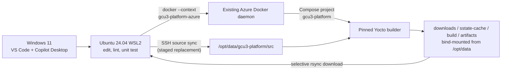

# Azure remote Yocto workflow

This workflow keeps editing and lightweight checks in Ubuntu 24.04 WSL2 while running containerized Yocto work on an existing Azure Ubuntu VM. It does not install or reconfigure the VM's Docker daemon.

## Architecture and isolation



| Location | Responsibility |
|---|---|
| Windows | VS Code UI, Copilot Desktop, WSL lifecycle |
| WSL2 | Source editing, Git, lightweight checks, SSH, local Docker tooling |
| WSL2 `default` Docker context | Local engine only; never used for Yocto |
| `gcu3-platform-azure` context | Explicit access to the existing Azure Docker daemon |
| Azure data disk | Only `/opt/data/gcu3-platform`; existing `/opt/data/yocto` is out of scope |
| Compose | Fixed project `gcu3-platform`; no privileged mode or named Docker volumes |

Docker evaluates bind-mount source paths on the daemon host. Therefore `/opt/data/gcu3-platform/src` is populated by SSH sync or remote clone; a local WSL path is never presented as an Azure bind mount.

## First-time setup

Open this repository in a **WSL window** in VS Code. Install the recommended extensions, then prepare local tools without local Yocto dependencies:

```bash
./linux/00_bootstrap.sh --profile direct
```

Copy the non-secret example and edit the endpoint, key path, local paths, pinned image, and remote UID/GID:

```bash
cp azure/.env.example azure/.env
chmod 600 azure/.env
```

Confirm the Azure SSH host fingerprint through a trusted channel and place it in `~/.ssh/known_hosts`. The context script deliberately does not disable host-key checking.

```bash
ssh-keyscan -p <port> <host> > /tmp/gcu3-host-key
ssh-keygen -lf /tmp/gcu3-host-key
# Compare the fingerprint out of band before appending the verified key.
cat /tmp/gcu3-host-key >> ~/.ssh/known_hosts
rm /tmp/gcu3-host-key
```

Create or update the SSH alias and Docker context. The script records no private data in Git, never runs `docker context use`, and verifies that the active `default` context remains local.

```bash
./azure/setup_context.sh
docker context show
./azure/verify.sh --offline
```

An administrator must already have attached and mounted the ext4 data disk at `/opt/data`. Prepare only the dedicated directories:

```bash
./azure/prepare_remote.sh
```

The script requires the SSH user to have passwordless/noninteractive Docker access and sufficient `sudo` access to create these directories:

```text
/opt/data/gcu3-platform/
├── src/
├── downloads/
├── sstate-cache/
├── build/
└── artifacts/
```

It validates the dedicated ext4 mount, minimum disk size, UID/GID ownership, and Docker access. It does not change `daemon.json`, `/var/lib/docker`, system services, or Docker objects.

## Builder image and registry authentication

`GCU3_YOCTO_IMAGE` is mandatory and must use an immutable `@sha256:` digest. Build and publish that image in a separate image repository/pipeline. Do not pass registry, proxy, or source credentials as Docker build arguments or bake them into layers.

Authenticate interactively in WSL using the registry's short-lived credential flow, then pull through the explicit context:

```bash
docker login ghcr.io
# For ACR, use the approved Azure CLI/token flow instead.
./azure/compose.sh pull
```

Docker credentials remain in the user's local credential store; they are not written to this repository. Compose transmits pull authorization to the selected daemon.

## Source transfer

Stop the project before replacing source:

```bash
./azure/compose.sh stop
./azure/sync_source.sh
```

Sync builds a new, uniquely named staging tree, excludes Git metadata, secrets, local environments, caches, and build output, then atomically replaces only `/opt/data/gcu3-platform/src`. It does not use `rsync --delete`.

As an alternative, clone a public repository or a repository the VM can already authenticate to:

```bash
./azure/remote_clone.sh git@github.com:ORG/gcu3-platform.git <branch-or-tag>
```

The clone is also staged and atomically activated. The script never installs or copies credentials; remote SSH/Git authentication must already be approved and configured.

## Run, stop, and resume

Starting the builder does not start a Yocto build:

```bash
./azure/compose.sh start
./azure/compose.sh status
./azure/compose.sh shell
```

Inside the shell, invoke the `gcu3-platform`-documented setup and build command explicitly. The container receives:

| Variable/path | Persistent remote bind |
|---|---|
| `DL_DIR=/downloads` | `/opt/data/gcu3-platform/downloads` |
| `SSTATE_DIR=/sstate-cache` | `/opt/data/gcu3-platform/sstate-cache` |
| `BUILDDIR=/build` | `/opt/data/gcu3-platform/build` |
| `GCU3_ARTIFACTS_DIR=/artifacts` | `/opt/data/gcu3-platform/artifacts` |

The current conservative settings are two threads and 6 GB. After VM resize, tune the CPU, memory, `BB_NUMBER_THREADS`, and `PARALLEL_MAKE` values together.

```bash
./azure/compose.sh logs 200
./azure/compose.sh stop     # cache/build bind mounts persist
./azure/compose.sh start    # resume with the same bind-mounted state
./azure/compose.sh down     # removes only this project's container/network
```

No script performs prune or broad cleanup.

## Artifact retrieval

Export deliberate deliverables from the build tree into a named path under `/artifacts`, then request only that relative path:

```bash
./azure/compose.sh stop
./azure/download_artifacts.sh build-20260731/gcu3-image.wic.zst
```

The downloader requires the project to be stopped, rejects traversal and symlink escapes, does not use deletion, and leaves unrelated local and remote artifacts untouched. Keep large outputs outside Git.

## Read-only verification and recovery

Offline validation checks local tools, default-context isolation, project naming, non-privileged mode, and all five bind mounts:

```bash
./azure/verify.sh --offline
```

Full validation additionally reads remote Docker capacity/data-root, the ext4 data path, directory layout, and project-scoped container status:

```bash
./azure/verify.sh
```

Common recovery actions:

| Failure | Safe recovery |
|---|---|
| SSH/context mismatch | Recheck `azure/.env`, verified host key, then rerun `setup_context.sh` |
| Registry pull denied | Refresh the approved local registry login; never add a token to `.env` |
| Interrupted source sync | Rerun sync while the project is stopped; staging names are unique |
| Builder command failed | Inspect a bounded log tail and `/build`; do not prune caches or other images |
| Root filesystem pressure | Stop before pulling more images; involve the VM owner. Never move Docker data-root in this workflow |
| Cache corruption confirmed | Remove only an explicitly identified path under this project's cache with owner approval |

## Data-disk growth to 1 TB

Azure disk resize and filesystem growth are administrator operations outside these scripts. After the administrator expands the partition/filesystem, validate read-only:

```bash
ssh gcu3-platform-azure 'findmnt -T /opt/data; lsblk -f; df -hT /opt/data'
```

Set `GCU3_MIN_DATA_DISK_GB=900`, choose an appropriate `GCU3_MIN_FREE_DISK_GB`, and rerun `./azure/verify.sh`. Do not assume the Azure control-plane resize automatically enlarged ext4.

## Security and capacity assumptions

- SSH private keys, registry tokens, proxy credentials, and `.env` are ignored and never copied to the VM source tree.
- The Docker socket and `docker` group are root-equivalent; access must be limited to approved users.
- The builder drops all capabilities, enables `no-new-privileges`, and is not privileged. A BSP that proves it needs a capability should receive the narrow capability only after review.
- Existing containers, images, networks, services, `/opt/data/yocto`, and Docker daemon configuration are untouched.
- The existing **Standard_D2ds_v5 (2 vCPU, 8 GB)** is below the routine Yocto target of 4+ vCPU and 16+ GB RAM.
- The 512-GB data disk currently has only **about 121 GB free**, below the configured 200-GB routine-build target. Verification reports this as a warning; review old project-owned output and the 1-TB expansion before building. Never clean unrelated data.
- Compute resize and free-space review remain capacity blockers for routine builds. Do not shift full builds to local WSL.
