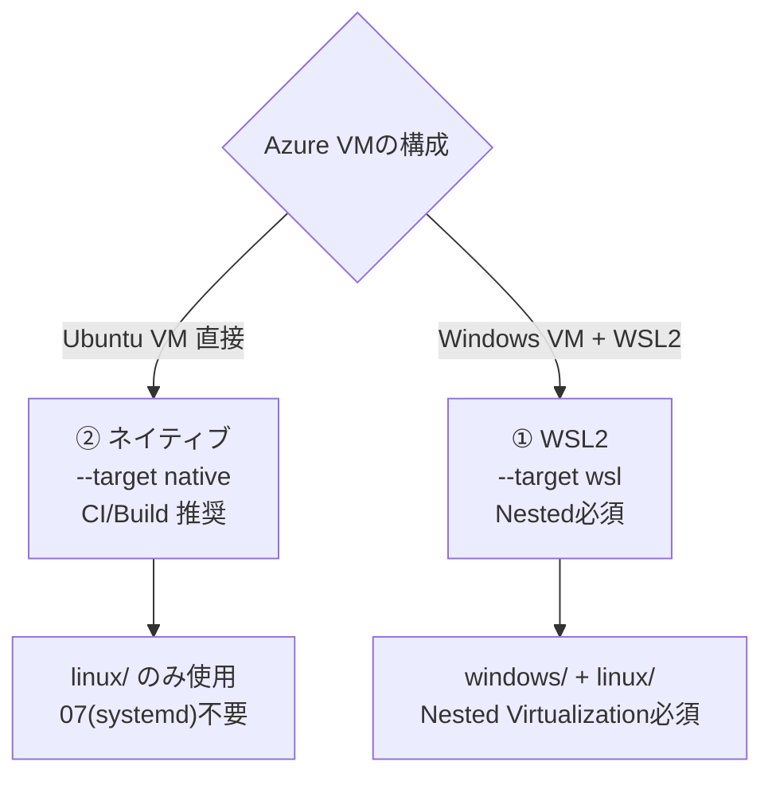

# GCU3 Bootstrap — Azure VM 対応ガイド（v1.02）

> **対象**：Azure VM 上で GCU3 開発/CI環境を構築する担当者
> **前提**：bootstrap v1.02（`--target native|wsl|auto` 対応）
> **status**：FINAL v1.02 / 2026.07 / Osaka

---

## 0. 2つのパターン



| 観点 | ① Windows VM + WSL2 | ② Ubuntu VM 直接（推奨:CI/Build） |
|---|---|---|
| WSL2 | 必要（Nested必須） | 不要 |
| VMサイズ | v3以上/非B系 | 制限なし |
| systemd(07) | 必要 | 不要（既定ON） |
| bootstrap | windows + linux 両方 | linux のみ |
| target | `--target wsl` | `--target native` |
| profile | azure-vm | azure-vm |

---

## 1. パターン②：Ubuntu VM 直接（推奨・CI/Build）

### 1.1 事前準備
- Azure Portal / CLI で **Ubuntu 24.04 LTS** のVMを作成
- ディスク：通常20GB以上／Yoctoなら140GB以上のデータディスク
- SSHでVMへログイン

### 1.2 セットアップ

```bash
# ツール配置（scp や git 等でVMへ）
cd ~/workspace/gcu3-bootstrap
chmod +x linux/*.sh linux/lib/*.sh

# Proxy使用時のみ（VM側Proxy）。直結なら不要
export SECRET_PROXY_URL="http://<vm-proxy>:8080"

# ★ native 指定で一括構築（07/systemdは自動スキップ）
./linux/00_bootstrap.sh --profile azure-vm --target native

# CI/Build用にフル構成なら
./linux/00_bootstrap.sh --profile azure-vm --target native \
  --enable-yocto --enable-embedded-tools
```

### 1.3 ポイント
- `07_enable_systemd.sh` は **不要**（ネイティブUbuntuは最初からsystemd）。
  - `--target native` 指定時、07を呼んでも「不要」と表示しスキップします。
- `require_ubuntu_env native` によりWSL警告は出ません。
- Docker/Python/自動更新/Yoctoは**そのまま動作**します。
- `--target auto`（既定）でも、WSL非検出なら自動でnative扱いになります。

### 1.4 反映・確認
```bash
newgrp docker
docker run --rm hello-world
python3 --version
```

---

## 2. パターン①：Windows VM + WSL2（Nested必須）

### 2.1 まず Nested 可否を判定（★重要）

Azure VMでWSL2を動かすには **Nested Virtualization** が必須です。まず判定します。

```powershell
# Azure Windows VM 内（PowerShell）
./windows/00_precheck_azure.ps1
```

判定内容：
- **Bシリーズ → 不可**
- **v3世代未満 → 非推奨/不可**
- v3以上（Dsv3/Ev3/Fsv2/v4/v5系）→ 可
- TrustedLaunch かつ 非v5系 → 警告（標準セキュリティ or v5系を検討）

### 2.2 WSL2導入 → 一括構築

判定OKなら、ローカルと同じ流れです。

```powershell
./windows/01_install_wsl2.ps1        # 再起動→ユーザー作成
./windows/02_configure_wslconfig.ps1 -Profile light
wsl --shutdown
```

```bash
# WSL内
./linux/07_enable_systemd.sh          # WSLなので必要 → wsl --shutdown → 再起動
export SECRET_PROXY_URL="http://<vm-proxy>:8080"
./linux/00_bootstrap.sh --profile azure-vm --target wsl
```

### 2.3 Nested が使えない場合
- 対策A：VMサイズを **v3世代以上（非B系）** へ変更（停止→サイズ変更→起動）
- 対策B：**パターン②（Ubuntu直接 / --target native）** へ切替（CI/Buildなら推奨）

---

## 3. Proxy（Azure VM）

`config/profiles/azure-vm.env` は用意済みです。

| 項目 | 内容 |
|---|---|
| Proxy参照 | `HTTP_PROXY_REF=SECRET_PROXY_URL`（実値は環境変数） |
| NO_PROXY | `.kubota.co.jp,169.254.169.254`（IMDSメタデータを除外） |
| 直結の場合 | Secret未設定でOK（`--profile azure-vm` のまま） |

> IMDS(169.254.169.254)は必ずNO_PROXY対象。v1.02の検出はIMDSをno_proxy強制で取得します。

---

## 4. トラブルシューティング（Azure特有）

| 症状 | 原因 | 対処 |
|---|---|---|
| WSL2が起動しない/VMエラー | Nested非対応VM(B系/v3未満) | `00_precheck_azure.ps1`で判定 → VMサイズ変更 or native |
| `--target auto`がwsl扱い | 稀に判定誤り | 明示的に `--target native` を指定 |
| IMDS取得で待たされる | Proxy経由でメタデータ取得 | v1.02はno_proxy強制済。手動時も `NO_PROXY=169.254.169.254` |
| docker権限エラー | グループ未反映 | `newgrp docker` |
| systemd無効(native) | 稀な最小イメージ | `sudo systemctl` 稼働確認、必要ならcloud-init見直し |
| Yoctoが遅い/容量不足 | ディスク/RAM不足 | データディスク増設、VMサイズ拡大 |

---

## 5. 目的別の推奨まとめ

| 目的 | 推奨 | コマンド例 |
|---|---|---|
| CI/Buildランナー | Ubuntu VM 直接 | `./linux/00_bootstrap.sh --profile azure-vm --target native --enable-yocto` |
| 開発者PC環境の完全再現 | Windows VM + WSL2 | `00_precheck_azure.ps1` → `01_install_wsl2.ps1` → `--target wsl` |
| ローカルPC | WSL2 | `--target wsl`（または auto） |
