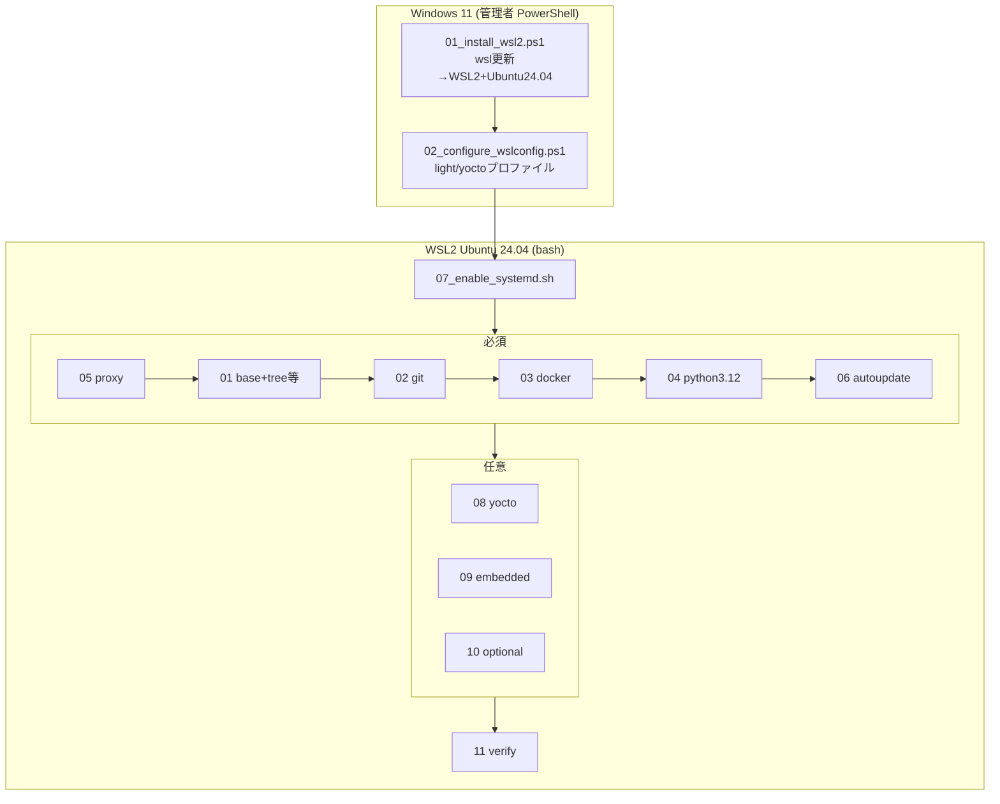
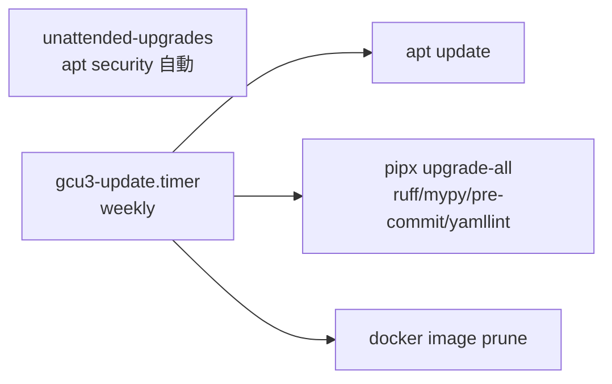

# GCU3 開発環境 構築ガイドライン（v1.01）

> **対象**：GCU3 Phase1 の開発ホストを新規構築する開発者
> **到達点**：WSL2 Ubuntu 24.04 + git + Docker Engine + Python 3.12 が動作し、`orc` を実行できる状態
> **拠点前提**：大阪オフィス / 自宅Squid / Azure VM（Proxyはプロファイル切替）
> **方針**：Docker Desktop 非依存／OSSは原則 latest（自動更新）／セキュリティは Phase1 固定
> **status**：FINAL v1.01 / 2026.07 / Osaka
> **v1.01差分（v1.00→）**：4段階構成(Base/Yocto/Embedded/Optional)・tree等追加・自動更新(06)新設・Python3.12標準・Proxy認証情報の非永続化・Docker検証分離・WSL事前確認

---

## 0. 全体像



---

## 1. 前提条件

| 項目 | 要件 |
|---|---|
| OS | Windows 11（22H2 以降推奨） |
| WSL | `wsl --version` が 2.4.10 以上（Ubuntu24.04新形式のため） |
| 権限 | WSL導入時のみ管理者PowerShell。以降はWSL内で一般ユーザー+sudo |
| 仮想化 | BIOS/UEFIで VT-x/AMD-V 有効 |
| ディスク | 通常20GB以上／Yoctoは140GB以上を推奨 |
| RAM | 通常8GB／Yoctoは32GB級を推奨 |

---

## 2. パッケージ4段階構成

| 段階 | スクリプト | 主な内容 | 既定 |
|---|---|---|---|
| Base（必須） | 01 | tree/file/rsync/dos2unix/zip/unzip/tar/xz/zstd/lz4/cmake/ninja/shellcheck/git-lfs 他 | 常時 |
| Git（必須） | 02 | git既定＋git-lfs（SSH鍵は明示時のみ） | 常時 |
| Docker（必須） | 03 | Engine+Compose+Buildx、ログローテ | 常時 |
| Python（必須） | 04 | Python3.12(system)＋venv＋pipx(ruff/mypy/pre-commit/yamllint) | 常時 |
| Proxy（必須※） | 05 | profile適用・NO_PROXY3層・認証情報は非永続 | profile時 |
| AutoUpdate（必須） | 06 | unattended-upgrades＋週次自動更新timer | 既定ON |
| Yocto（任意） | 08 | A55 Yoctoホスト依存＋BSP補助 | `--enable-yocto` |
| Embedded（任意） | 09 | M7/M33クロス・実機接続 | `--enable-embedded-tools` |
| Optional（任意） | 10 | htop/ncdu/ripgrep/tmux 他 | `--enable-optional-tools` |

---

## 3. OSS・バージョン管理（自動更新）

### 3.1 方針
- **原則 latest**：OSS・開発ツールはバージョン固定せず、最新を利用（`lib/versions.sh`）。
- **PINは最小限**：互換要件があるものだけ固定。Phase1では Python のみ `system(3.12)` を既定PIN。
- **最初から自動更新**：06で `unattended-upgrades`（セキュリティ）＋週次 `gcu3-update.timer`（apt/pipx/docker prune）を設置。

### 3.2 自動更新の仕組み



| 対象 | 更新方法 | 既定 |
|---|---|---|
| OSセキュリティ | unattended-upgrades | 自動（security scope） |
| 開発ツール(pipx) | gcu3-update.timer が `pipx upgrade-all` | 週次 |
| Docker不要イメージ | 週次 prune | 週次 |
| 手動更新 | `sudo /usr/local/bin/gcu3-selfupdate` | 任意 |

### 3.3 制御オプション
```bash
# 自動更新を入れない
./00_bootstrap.sh --profile office-osaka --no-autoupdate
# 通常更新も自動（検証環境向け。既定は security のみ）
./00_bootstrap.sh --profile office-osaka --auto-update-scope all
```

> **latest記載の意味**：本ガイド／スクリプトで「latest」と記したものは、バージョン固定せず自動更新対象であることを示します。

---

## 4. セキュリティ（Phase1固定）

Phase1では過剰実装を避け、次の最小方針で固定します。

| 項目 | Phase1方針 |
|---|---|
| Proxy資格情報 | **永続ファイルへ平文保存しない**。認証付きURLは現在shellのみ（export） |
| 認証なしProxy | apt/environment への設定を許容 |
| プロファイル読込 | `source`せず**安全な行パーサ**で読む（任意コード実行防止） |
| Secret | `*_REF`で環境変数参照。ファイルに実値を書かない |
| dockerグループ | root相当権限に注意。付与後は再ログイン/newgrp |
| OSセキュリティ更新 | unattended-upgrades で自動 |

> L3のproxy-manager一元管理やSAST/SCA等の高度なセキュリティはPhase3で扱い、Phase1では上記固定とする。

---

## 5. 手順（Windows側）

```powershell
Set-ExecutionPolicy -Scope Process -ExecutionPolicy Bypass
# WSL更新→WSL2+Ubuntu24.04（wsl --version/--update を内部で確認）
./windows/01_install_wsl2.ps1
# 再起動 → Ubuntu初回起動でユーザー作成

# 任意: リソース設定（Yoctoなら -Profile yocto）
./windows/02_configure_wslconfig.ps1 -Profile light
# Yocto用: ./windows/02_configure_wslconfig.ps1 -Profile yocto
wsl --shutdown
```

---

## 6. 手順（WSL内 / bash）

```bash
# 配置して実行権限付与
chmod +x linux/*.sh linux/lib/*.sh

# systemd有効化（Docker/timer管理に必要）→反映のため一旦 shutdown
./linux/07_enable_systemd.sh
# Windowsで: wsl --shutdown → Ubuntu再起動

# Secret（Proxy使用時のみ）
export SECRET_PROXY_URL="http://proxy.kubota.local:8080"

# 一括構築（大阪・必須のみ）
./linux/00_bootstrap.sh --profile office-osaka

# フル（Yocto/Embedded/Optionalも）
./linux/00_bootstrap.sh --profile office-osaka \
  --enable-yocto --enable-embedded-tools --enable-optional-tools

# 直結（Proxyなし） / 事前確認
./linux/00_bootstrap.sh --profile direct
./linux/00_bootstrap.sh --profile office-osaka --dry-run
```

反映後:
```bash
newgrp docker
docker run --rm hello-world
python3 --version   # 3.12.x
git --version
```

---

## 7. Yocto（A55）を行う場合の注意

- `--enable-yocto` で 08 が動作（chrpath/cpio/diffstat/gawk/python3-git 等を導入）。
- **リソース**：空きディスク140GB以上、RAM32GB級、多コア推奨 → `02_configure_wslconfig.ps1 -Profile yocto`。
- **配置**：`/home/$USER/work/...`（`/mnt/c` は性能劣化のため非推奨）。
- ベンダーSDK（i.MX BSP等）は手順に従い別途取得。

---

## 8. トラブルシューティング

| 症状 | 原因 | 対処 |
|---|---|---|
| docker 権限エラー | グループ未反映 | `newgrp docker` または再ログイン |
| docker info 失敗 | systemd未有効 | 07実行 → `wsl --shutdown` → 再起動 |
| hello-world取得失敗 | Proxy未通過 | `SECRET_*` 設定と `--profile` 確認 |
| apt遅い/失敗 | Proxy不整合 | `/etc/apt/apt.conf.d/95gcu3-proxy` 確認（認証付きは非永続） |
| Python3.11が要る | 標準は3.12 | `--python-version deadsnakes-3.11`（社内承認前提） |
| Yoctoビルド不安定 | 容量/RAM不足 | `-Profile yocto`、/home配下、ディスク増設 |
| 自動更新が動かない | systemd未有効 | 07実行後に 06 が有効化。手動: `gcu3-selfupdate` |
| WSL古い | 2.4.10未満 | `wsl --update` |

---

## 9. アンインストール / リセット

```powershell
wsl --unregister Ubuntu-24.04   # データ消去に注意
```
```bash
# Proxy設定解除
sudo sed -i '/# >>> GCU3 proxy >>>/,/# <<< GCU3 proxy <<</d' /etc/environment
sudo rm -f /etc/apt/apt.conf.d/95gcu3-proxy
# 自動更新timer停止
sudo systemctl disable --now gcu3-update.timer 2>/dev/null || true
```

---

## 10. 次のステップ（GCU3 Orchestrator）

```bash
git clone <repo-url> gcu3-devplat && cd gcu3-devplat
python3 -m venv .venv && source .venv/bin/activate
python -m pip install --upgrade pip setuptools wheel
pip install -e .
orc --help
orc build --target a55,m7,m33 --profile office-osaka
```
- 詳細は `05_Phase1_詳細設計_v1.00.md` / `06_実装ガイドライン_v1.00.md` を参照。
