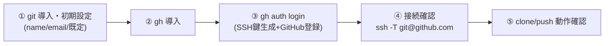

# git & gh（GitHub CLI）セットアップ手順 v1.0

> **対象**：WSL2 Ubuntu 24.04 / Azure Ubuntu VM の開発ホスト
> **到達点**：git の初期設定完了 → gh でSSH認証 → GitHubへ push/clone できる状態
> **作成**：2026-07-27 / Osaka
> **表記ルール**：全コマンドは 🐧 **Ubuntu(bash)** で実行。プロンプト記号(`$`,`PS>`)は付けない＝コピペ事故防止

---

## 0. 全体フロー



- **git**：バージョン管理本体。まず名前・メール等を設定。
- **gh**：GitHub CLI。認証・SSH鍵登録・PR操作を自動化。

---

## 1. 【git】導入と初期設定

### 1-1. git 導入確認

```
git --version
```

未導入なら導入します。

```
sudo apt update
```

```
sudo apt install -y git
```

### 1-2. ユーザー名・メール（必須）

コミット記録に使われます。実名・社内メールに置換してください。

```
git config --global user.name "Gunhwa Geon"
```

```
git config --global user.email "gunhwa_geon@kubota.com"
```

### 1-3. 推奨既定（1行ずつ）

```
git config --global init.defaultBranch main
```

```
git config --global pull.rebase false
```

```
git config --global core.autocrlf input
```

```
git config --global core.editor "vim"
```

```
git config --global color.ui auto
```

```
git config --global fetch.prune true
```

WSLでの権限誤検知を防ぐ設定。

```
git config --global core.fileMode false
```

### 1-4. 設定確認

```
git config --global --list
```

---

## 2. 【gh】GitHub CLI 導入

### 2-1. 導入確認

```
gh --version
```

未導入なら公式リポジトリから導入します（1ブロックずつ）。

```
sudo mkdir -p -m 755 /etc/apt/keyrings
```

```
curl -fsSL https://cli.github.com/packages/githubcli-archive-keyring.gpg | sudo tee /etc/apt/keyrings/githubcli-archive-keyring.gpg > /dev/null
```

```
sudo chmod go+r /etc/apt/keyrings/githubcli-archive-keyring.gpg
```

```
echo "deb [arch=$(dpkg --print-architecture) signed-by=/etc/apt/keyrings/githubcli-archive-keyring.gpg] https://cli.github.com/packages stable main" | sudo tee /etc/apt/sources.list.d/github-cli.list > /dev/null
```

```
sudo apt update
```

```
sudo apt install -y gh
```

確認します。

```
gh --version
```

---

## 3. 【gh】認証（SSH推奨・鍵生成〜登録を自動化）

`gh auth login` を対話で実行します。SSHを選ぶと**鍵生成〜GitHubへの公開鍵登録まで自動**です。

```
gh auth login
```

プロンプト選択の指針：

| 質問 | 選択 |
|---|---|
| What account do you want to log into? | **GitHub.com**（社内はGHES） |
| Preferred protocol for Git operations? | **SSH** |
| Generate a new SSH key…? | **Yes**（既存があれば選択） |
| Enter a passphrase | 任意（**パスフレーズ推奨**） |
| Title for your SSH key | 例：`gcu3-wsl` |
| How would you like to authenticate GitHub CLI? | **Login with a web browser** |

→ ワンタイムコードを控えてEnter → 表示URLをWindowsブラウザで開く → コード入力 → **Authorize**。

### 非対話で一発実行

```
gh auth login --hostname github.com --git-protocol ssh --web
```

### 社内 GitHub Enterprise の場合

```
gh auth login --hostname github.<company>.com --git-protocol ssh --web
```

### HTTPSで使う場合（SSH鍵を作らない）

```
gh auth login --hostname github.com --git-protocol https --web
```

---

## 4. 接続・認証の確認

認証状態を確認します。

```
gh auth status
```

SSH接続を確認します。

```
ssh -T git@github.com
```

`Hi <ユーザー名>! You've successfully authenticated...` が出ればOKです。

（gh経由でgitのSSHを既定化）

```
gh config set git_protocol ssh
```

---

## 5. 動作確認（clone / push）

### 5-1. clone（`<ORG>` は置換）

gh経由:

```
gh repo clone <ORG>/gcu3-devplat
```

通常のgit:

```
git clone git@github.com:<ORG>/gcu3-devplat.git
```

### 5-2. push テスト（既存リポジトリ内で）

```
cd ~/workspace/gcu3-devplat
```

```
git switch -c test/gh-setup
```

```
git commit --allow-empty -m "chore: verify gh/git setup"
```

```
git push -u origin test/gh-setup
```

エラーなくpushできれば連携完了です。

---

## 6. gh 日常操作（よく使う）

| 目的 | コマンド |
|---|---|
| リポジトリ情報 | `gh repo view` |
| PR作成 | `gh pr create` |
| PR一覧 | `gh pr list` |
| PRをローカルへ | `gh pr checkout <番号>` |
| PRマージ | `gh pr merge <番号>` |
| Issue作成 | `gh issue create` |
| リポジトリclone | `gh repo clone <ORG>/<repo>` |
| 認証状態 | `gh auth status` |
| SSH鍵一覧 | `gh ssh-key list` |

---

## 7. SSH鍵を手動管理する場合（gh自動を使わない）

### 7-1. 鍵生成（ed25519・パスフレーズ推奨）

```
ssh-keygen -t ed25519 -C "gunhwa_geon@kubota.com"
```

### 7-2. ssh-agent へ登録

```
eval "$(ssh-agent -s)"
```

```
ssh-add ~/.ssh/id_ed25519
```

### 7-3. 公開鍵をGitHubへ登録（ghがあれば）

```
gh ssh-key add ~/.ssh/id_ed25519.pub -t gcu3-wsl
```

（ghを使わない場合は、`~/.ssh/id_ed25519.pub` の内容をGitHub → Settings → SSH and GPG keys に貼り付け）

### 7-4. known_hosts 登録（初回警告回避）

```
ssh-keyscan github.com >> ~/.ssh/known_hosts
```

---

## 8. Proxy 環境での注意（大阪オフィス等）

Proxy越しに認証する場合は、先にProxyを設定してから gh を実行します（値は自環境に置換）。

```
export HTTP_PROXY="http://proxy.kubota.local:8080"
```

```
export HTTPS_PROXY="http://proxy.kubota.local:8080"
```

```
export NO_PROXY="localhost,127.0.0.1,.kubota.co.jp"
```

その後、

```
gh auth login --hostname github.com --git-protocol ssh --web
```

> SSH(22番)が社内で塞がれている場合は、HTTPS(`--git-protocol https`)や 443ポート経由SSH（`~/.ssh/config`でgithub.comをssh.github.com:443へ）を検討してください。

---

## 9. トラブルシューティング

| 症状 | 原因 | 対処 |
|---|---|---|
| `gh: command not found` | 未導入 | 「2. gh導入」を実施 |
| `Permission denied (publickey)` | 鍵未登録/agent未登録 | `gh auth status` → `gh ssh-key add ~/.ssh/id_ed25519.pub` / `ssh-add` |
| ブラウザが開かない(WSL) | WSLはGUI無し | 表示URLをWindowsブラウザへ手動貼付、コード入力 |
| ホスト鍵警告 | known_hosts未登録 | `ssh-keyscan github.com >> ~/.ssh/known_hosts` |
| `git@github.com: Connection timed out` | SSH(22)が社内で遮断 | HTTPS利用 or 443経由SSH |
| Proxyで認証不可 | Proxy未設定 | 「8. Proxy環境」を実施 |
| GHESで失敗 | ホスト未指定 | `--hostname github.<company>.com` |
| commit名/メールが違う | git未設定 | 「1-2」を実施 |

---

## 10. 最短手順（まとめ）

git 初期設定：

```
git config --global user.name "Your Name"
```

```
git config --global user.email "you@example.com"
```

gh 導入済み前提での認証〜確認：

```
gh auth login --hostname github.com --git-protocol ssh --web
```

```
gh auth status
```

```
ssh -T git@github.com
```

これで **git（設定）＋ gh（SSH認証・鍵登録）＋ 接続確認** まで完了します。
以降は `git clone git@github.com:<ORG>/<repo>.git` で取得できます。
