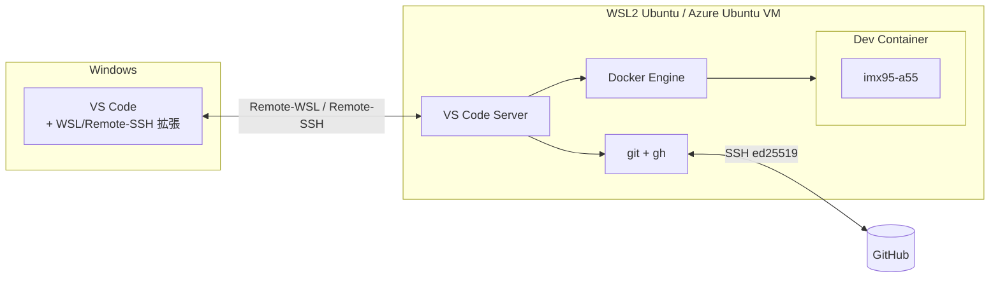
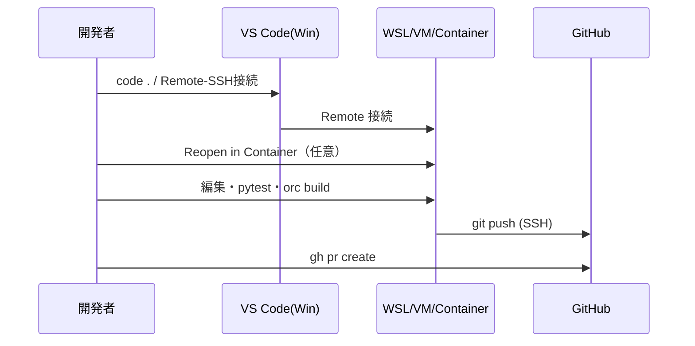

# WSL2 Ubuntu × VS Code × GitHub × Docker 連携ガイド（v1.1）

> **対象**：GCU3 開発者（WSL2 Ubuntu 24.04 / Azure Ubuntu VM）
> **到達点**：VS CodeからWSL/コンテナ/リモートへ接続し、GitHubへSSHでpush、Dockerをコード管理
> **前提**：released `gcu3-bootstrap` で git / Docker Engine / Python 済み
> **status**：FINAL v1.1 / 2026.07 / Osaka
> **v1.1差分（MECE是正）**：①配置場所とREADME関連付けを明記 ②Azure native(Remote-SSH)経路を追加 ③gh手順を`20_`に一本化 ④gh Proxy手順を追記

---

## 0. このツールの置き場所（released bootstrap との関係）★MECE是正①

本連携ツールは **released `gcu3-bootstrap` の `integration/` 配下** に置きます。

```text
gcu3-bootstrap/            ← Release済み（環境構築）
├─ README.md               ← §9 GitHub連携 から本ツールを参照
├─ linux/                  ← 01〜11（bootstrap本体：git/docker/python導入）
├─ docs/
└─ integration/            ← ★本ツール（VS Code×GitHub×Docker 連携）
   ├─ linux/{00_integration,20_github_cli,21_docker_manage,22_vscode}.sh
   ├─ vscode/{settings,extensions,tasks,launch}.json
   ├─ devcontainer/devcontainer.json
   └─ docs/GUIDE_VSCode_GitHub_Docker.md   ← 本書
```

| 役割分担（重複排除） | 担当 |
|---|---|
| Docker **導入(install)** | bootstrap `linux/03_setup_docker.sh` |
| Docker **管理(manage)** | integration `21_docker_manage.sh` |
| git/gh **導入・認証** | integration `20_setup_github_cli.sh`（gh手順の唯一の実装） |

> README への関連付けは本書末尾「11. README追記」を参照。

---

## 1. 全体アーキテクチャ



- **VS Code本体はWindows**、実処理は**WSL/VM/コンテナ側**。
- **接続経路は2種**：ローカルWSL=**Remote-WSL** ／ Azure Ubuntu VM=**Remote-SSH**。★MECE是正②
- **GitHubはSSH(ed25519)**、`gh`で認証・鍵登録を自動化。
- **DockerはHost上のEngine**（Desktop非依存）。拡張とCLIの両輪。

---

## 2. クイックスタート（一括）

🐧 Ubuntu(bash)

```
cd ~/workspace/gcu3-bootstrap
```
```
chmod +x integration/linux/*.sh
```
```
./integration/linux/00_integration.sh --email you@kubota.com --project ~/work/gcu3-devplat
```

- `--target` は既定 `auto`（WSL検出でRemote-WSL、非WSLでRemote-SSHへ自動振り分け）。
- 完了後：
```
ssh -T git@github.com
```
```
cd ~/work/gcu3-devplat && code .
```

---

## 3. VS Code 連携

### 3.1 前提（Windows側）
- ローカルWSL：拡張 **WSL**（`ms-vscode-remote.remote-wsl`）
- Azure Ubuntu VM：拡張 **Remote - SSH**（`ms-vscode-remote.remote-ssh`）★MECE是正②

### 3.2 接続方法
| 環境 | 接続 | 起動 |
|---|---|---|
| ローカル WSL | Remote-WSL | WSLで `code .` |
| Azure Ubuntu VM | Remote-SSH | Windows VS Code → 「Remote-SSH: Connect to Host」→ VM選択 |

`~/.ssh/config`（Windows側）例：
```
Host gcu3-azure
  HostName <VMのIP or FQDN>
  User <vm-user>
  IdentityFile ~/.ssh/id_ed25519
```

### 3.3 拡張の一括導入（`22_setup_vscode.sh`）
Remote(wsl/containers/ssh) / Docker / GitHub(PR,GitLens) / Python(python,pylance,ruff) / 記述(yaml,toml,editorconfig) / C++(cpptools)。

### 3.4 プロジェクト設定（自動配置）
`.vscode/`（settings/extensions/tasks/launch）と`.devcontainer/`。既存は`.sample`で保存。

---

## 4. GitHub 連携（SSH + gh）★手順は 20_ に一本化（MECE是正③）

### 4.1 セットアップ内容（`20_setup_github_cli.sh`）
1. **gh** を公式aptから導入（latest）
2. **ed25519鍵**を用意（無ければ生成・パスフレーズ推奨）
3. **known_hosts**に登録（初回警告回避）
4. **gh auth login -p ssh -w** で認証
5. **公開鍵をGitHubへ登録**、`git_protocol=ssh`

### 4.2 Proxy環境（大阪オフィス等）★MECE是正④
🐧 Ubuntu(bash)（値は自環境に置換）
```
export HTTPS_PROXY="http://proxy.kubota.local:8080"
```
```
./integration/linux/20_setup_github_cli.sh --email you@kubota.com
```

### 4.3 接続確認
```
ssh -T git@github.com
```

### 4.4 社内 GitHub Enterprise
```
./integration/linux/20_setup_github_cli.sh --host github.<company>.com --email you@kubota.com
```

---

## 5. Docker 管理（`21_docker_manage.sh`）

`docker`→`sudo docker`を自動判定。

| コマンド | 内容 |
|---|---|
| status / test | 状態・hello-world疎通 |
| ps / images / df | 一覧・使用量 |
| prune / clean-all | 不要削除（clean-allは確認） |
| compose-up/down [dir] | 既定`./docker` |
| logs <name> / restart-daemon | ログ追尾 / 再起動 |

VS Code拡張：左Dockerアイコンでコンテナ/イメージ/Compose/VolumeをGUI管理。
tasks：Run Task → `docker: compose up/down` / `docker: status(manage)`。

---

## 6. Dev Container

1. `.devcontainer/devcontainer.json` 配置済み。
2. コマンドパレット → **Dev Containers: Reopen in Container**。
3. GCU3 `docker/docker-compose.yml` の `imx95-a55` に接続。

GCU3整合：**Proxyは焼き込まず**`remoteEnv`で実行時注入／`postCreate`で`venv`+`pip install -e .`／`features`でgit・gh・python3.12。

---

## 7. 典型ワークフロー



---

## 8. トラブルシューティング

| 症状 | 原因 | 対処 |
|---|---|---|
| `code`が無い | 拡張未導入/未初期化 | WSL:拡張'WSL'→`code .` / SSH:Remote-SSH接続後 |
| Azure VMにVS Codeで入れない | Remote-SSH未設定 | Windows拡張'Remote-SSH'＋`~/.ssh/config` |
| `Permission denied (publickey)` | 鍵未登録 | `gh ssh-key add ~/.ssh/id_ed25519.pub` / `ssh-add` |
| ホスト警告 | known_hosts未登録 | `ssh-keyscan github.com >> ~/.ssh/known_hosts` |
| docker権限 | グループ未反映 | `newgrp docker` / 再ログイン |
| Reopen失敗 | compose/service名 | `devcontainer.json`確認 |
| コンテナからネット不可 | Proxy未注入 | `remoteEnv`とHost `HTTP_PROXY` |
| GHES認証不可 | ホスト未指定 | `--host github.<company>.com` |
| gh がProxyで失敗 | Proxy未export | §4.2 を実施 |

---

## 9. セキュリティ（Phase1固定）

- SSH鍵は**パスフレーズ推奨**。秘密鍵は共有しない。
- Proxy/トークンを`.vscode`/`devcontainer.json`に**平文で書かない**（`localEnv`参照）。
- `gh`トークンは`gh`が保管（自前で平文保存しない）。

---

## 10. ファイル一覧

```text
integration/
├─ linux/{00_integration,20_setup_github_cli,21_docker_manage,22_setup_vscode}.sh
├─ vscode/{settings,extensions,tasks,launch}.json
├─ devcontainer/devcontainer.json
└─ docs/GUIDE_VSCode_GitHub_Docker.md
```

---

## 11. README 追記（released bootstrap との関連付け）★MECE是正①

`gcu3-bootstrap/README.md` の該当章を次に置換／追記します。

「9. GitHub 連携」章：
```
## 9. GitHub 連携 & 開発ツール連携（VS Code / Docker）
> 詳細: integration/docs/GUIDE_VSCode_GitHub_Docker.md
### 🐧 Ubuntu(bash) 一括
    chmod +x integration/linux/*.sh
    ./integration/linux/00_integration.sh --email you@kubota.com --project ~/work/gcu3-devplat
### 接続確認
    ssh -T git@github.com
```

「16. リポジトリ構成」に追記：
```
└─ integration/            # VS Code×GitHub×Docker 連携（docs/GUIDE_VSCode_GitHub_Docker.md）
```
